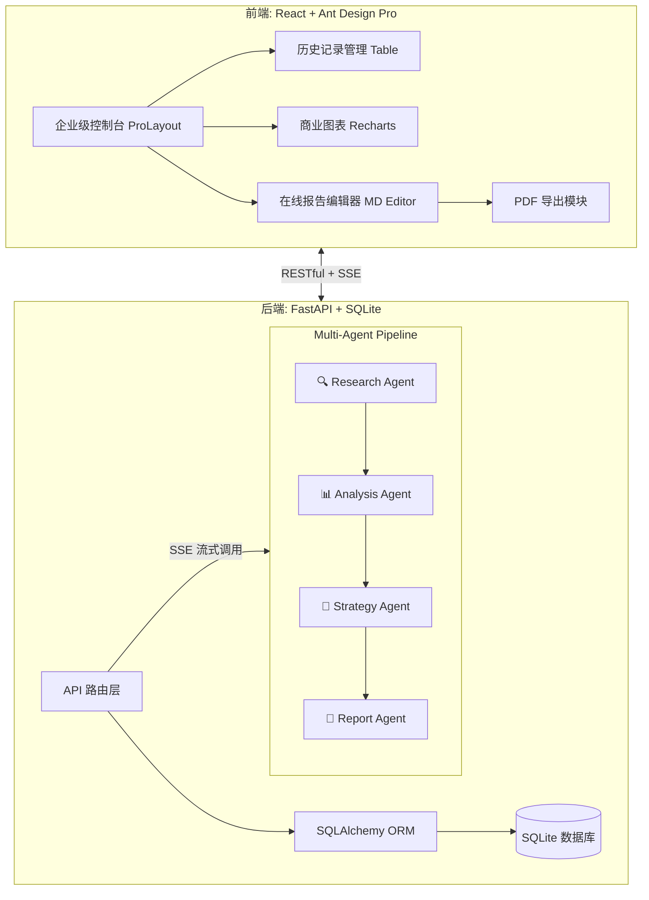

# 🚀 AI Competitor Analysis Pro (大厂 PM 级竞品分析平台)

基于 **Multi-Agent 架构** 和 **React + FastAPI** 前后端分离的企业级竞品分析 SaaS 平台。

本项目专为**互联网大厂 AI 产品经理 (AI PM)** 打造，将传统需要 1-2 天的竞品调研工作压缩至 **5 分钟**，并自动生成包含商业图表、SWOT、波特五力及战略建议的万字结构化报告。

---

## ✨ 核心业务价值 (Business Value)

1. **⏱️ 极致降本增效**：通过 4-Agent 协同流水线，实现“联网检索 -> 信息抽取 -> 深度推理 -> 报告生成”的全自动闭环。
2. **📊 商业分析结构化**：将非结构化的网页信息，自动映射到 SWOT、波特五力、商业模式画布等经典商业分析框架中。
3. **🛡️ 消除大模型幻觉**：摒弃“单一大 Prompt”模式，采用线性 DAG 工作流，每个 Agent 仅专注单一任务，并强制 JSON Schema 输出，确保数据流转的 100% 稳定性。
4. **💼 企业级 SaaS 体验**：提供完整的历史记录管理、可视化数据看板（雷达图、四象限）、在线 Markdown 富文本编辑及一键 PDF 导出功能。

---

## 🏗️ 系统架构 (Architecture)



### 核心技术栈
- **前端 (Frontend)**: React 18, Vite, Ant Design 5, Recharts (图表), @uiw/react-md-editor (在线编辑), html2pdf.js (导出)
- **后端 (Backend)**: Python 3.9+, FastAPI, SQLAlchemy, SQLite, Pydantic v2
- **AI 引擎 (AI Engine)**: OpenAI / DeepSeek API (支持动态切换), Tavily / Serper (联网搜索)

---

## 🚀 快速启动 (Quick Start)

### 1. 克隆项目
```bash
git clone https://github.com/yourusername/ai-competitor-analysis-pro.git
cd ai-competitor-analysis-pro
```

### 2. 启动后端 (FastAPI)
```bash
cd backend
python3 -m venv venv
source venv/bin/activate
pip install -r requirements.txt
uvicorn app.main:app --reload --port 8000
```

### 3. 启动前端 (React)
```bash
cd frontend
npm install
npm run dev
```
打开浏览器访问 `http://localhost:3000` 即可体验。

---

## 💡 面试官 Q&A 核心话术参考

**Q: 为什么采用 4 个 Agent 的流水线，而不是一个 Prompt 搞定？**
> **A:** 主要解决三个痛点：1. **控制幻觉**：一次性输入大量搜索结果要求输出万字报告，模型极易遗忘上下文。拆分后每个 Agent 职责单一，输出质量指数级提升。2. **结构化流转**：中间产物（如功能矩阵）需严格 JSON 格式供前端渲染图表，单次长输出难以保证格式稳定。3. **工程可观测性**：拆分后支持实时 SSE 进度推送，缓解用户等待焦虑，且单节点失败可快速重试。

**Q: 为什么作为产品经理要自己实现前后端分离？**
> **A:** 只有亲自下场处理过 JSON 解析失败、解决过大模型超时断连、实现过 SSE 流式推送，才能真正理解**大模型的工程边界**。这种对“AI 产品特有 UX”的体感，让我未来在撰写 PRD 和与研发沟通时，能提出技术上更可行、体验上更极致的方案。

---

## GitHub Pages（在线演示站）

本仓库已配置 [`.github/workflows/pages.yml`](.github/workflows/pages.yml)：推送到 `main` 会**自动构建前端**并发布到 **GitHub Pages**。

1. 在 GitHub 打开仓库 **Settings → Pages**  
2. **Build and deployment** 里，**Source** 选 **GitHub Actions**（不要选 branch）  
3. 等一次 `Deploy GitHub Pages` 工作流跑绿后，页面地址一般为：  
   `https://<你的用户名>.github.io/ai-competitor-analysis-pro/`

> **说明**：GitHub Pages 只托管**静态文件**，不运行 FastAPI。若要在网页上使用「分析 / 历史记录」，需先把后端部署到云主机（如 Railway、Render、Fly.io），并在仓库 **Settings → Secrets and variables → Actions** 中增加 Secret：  
> - 名称：`VITE_API_BASE`  
> - 值：你的 API **站点根地址**（如 `https://my-api.railway.app`，**不要**写 `/api` 结尾，构建时会自动拼上 `/api`）  
> 保存后，在 **Actions** 里重新运行 **Deploy GitHub Pages** 工作流。

未配置 `VITE_API_BASE` 时，站点仍可打开，但会提示需配置 API；本地开发仍用 `npm run dev` 走 Vite 代理，不受影响。

---

## GitHub Actions（CI）

仓库根目录已包含 [`.github/workflows/ci.yml`](.github/workflows/ci.yml)。将项目推送到 GitHub 后，在仓库页签打开 **Actions**，即可看到自动流水线：

- **Backend**：安装 Python 依赖并校验 `from app.main import app` 可正常执行  
- **Frontend**：`npm ci`（有 `package-lock.json` 时）或 `npm install`，并执行 `npm run build` 做生产构建

### 首次推送到自己的 GitHub 仓库

在本地项目根目录（`ai-competitor-analysis-pro/`）执行：

```bash
git init
git add .
git commit -m "feat: PM portfolio — AI competitive analysis pro"
git branch -M main
git remote add origin https://github.com/<你的用户名>/<仓库名>.git
git push -u origin main
```

推送成功后，**Actions** 中会出现名为 **CI** 的工作流；绿色表示构建通过。

> 注意：根目录 [`.gitignore`](.gitignore) 已排除 `venv/`、`node_modules/`、`backend/data/*.db` 等，不要把这些提交进仓库。

---

## 📄 开源协议
见仓库根目录 [LICENSE](LICENSE)（MIT License）。
